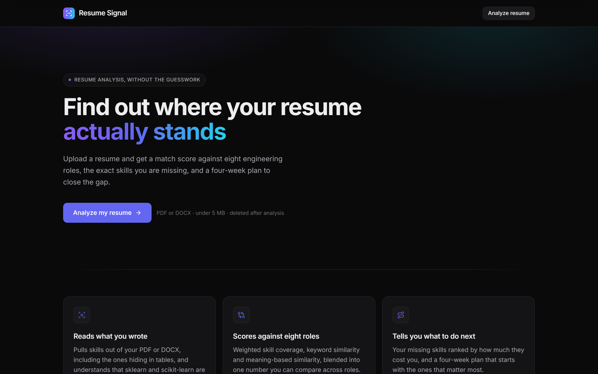
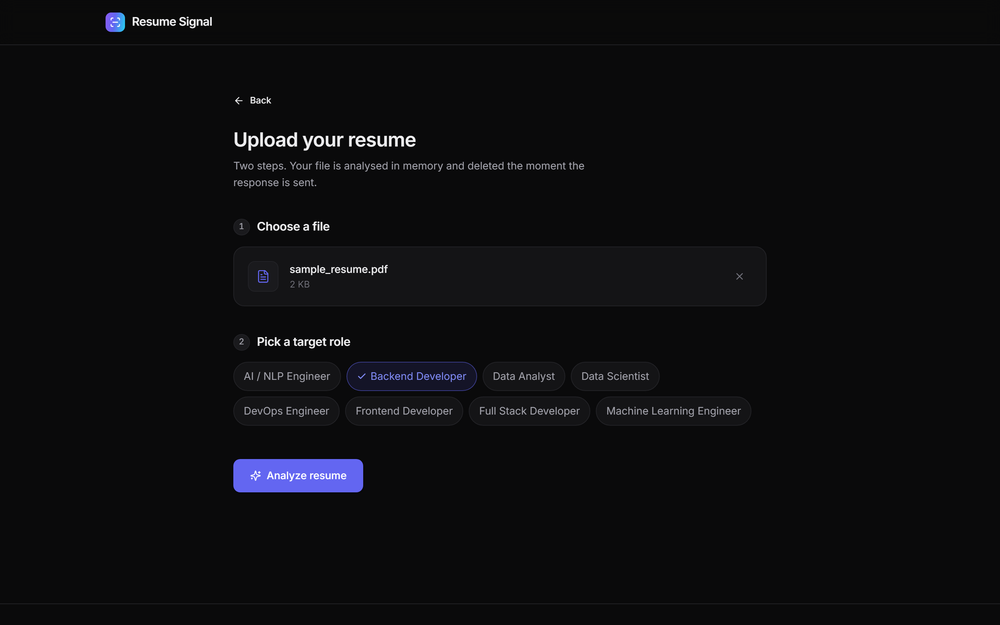
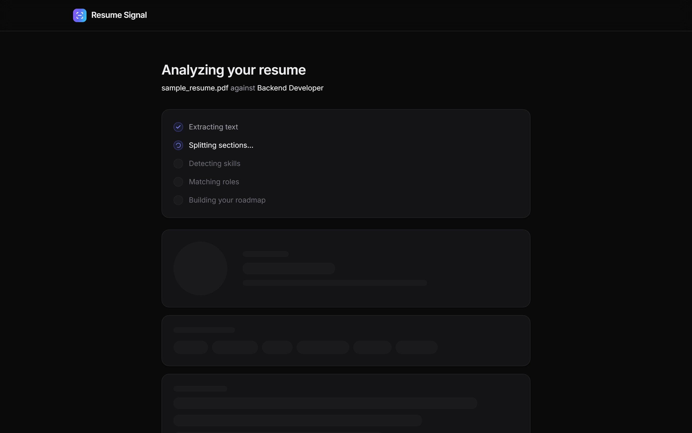
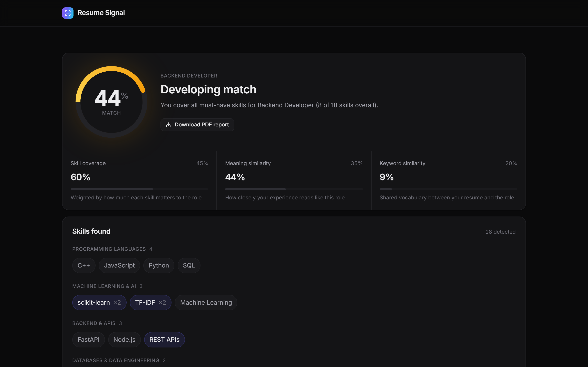
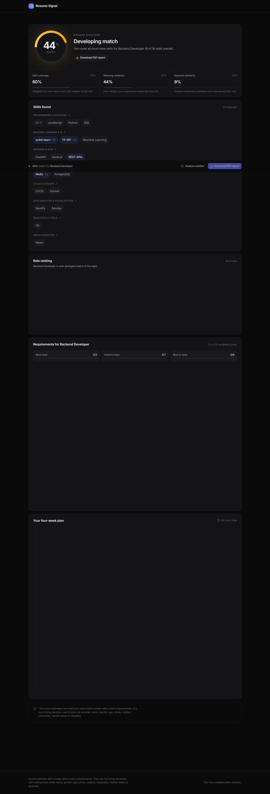
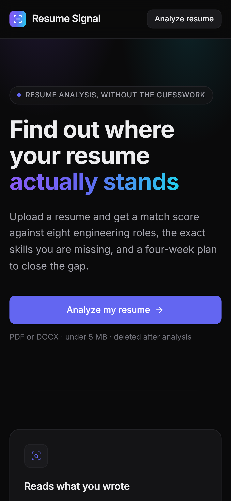
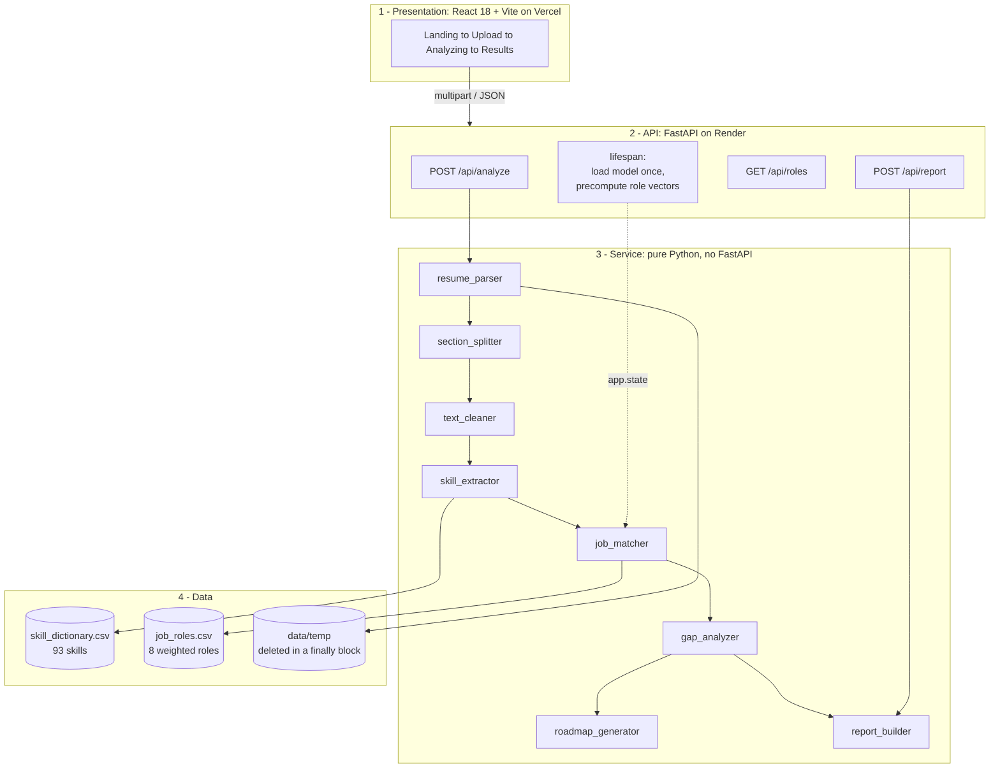
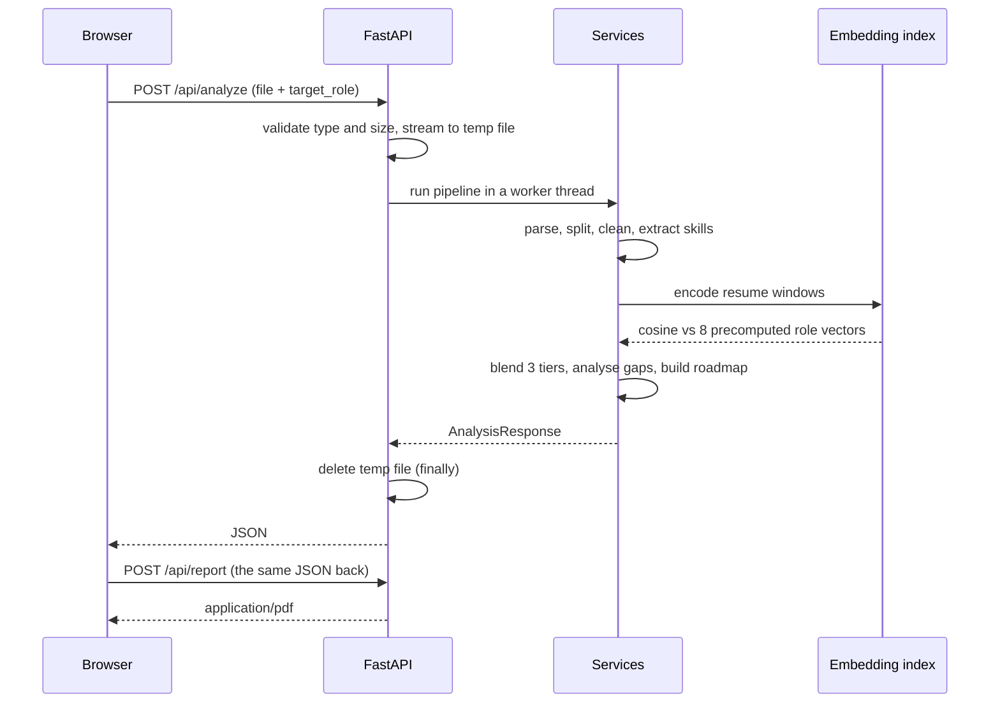

# Resume Signal

Upload a resume, get a weighted match score against eight engineering roles, the
exact skills you are missing, and a four-week plan to close the gap. Exportable
as a PDF report.

**Live:** [ai-resume-analyzer-topaz-two.vercel.app](https://ai-resume-analyzer-topaz-two.vercel.app)
&nbsp;·&nbsp; **API docs:** [ai-resume-analyzer-s8st.onrender.com/docs](https://ai-resume-analyzer-s8st.onrender.com/docs)

> The backend runs on a free instance that sleeps after 15 minutes idle. The
> first request after a nap takes 60–90 seconds while the container restarts and
> reloads the embedding model.

> **The score estimates skill overlap. It is not a hiring decision.** Nothing in
> this system extracts or scores name, gender, age, photo, religion,
> nationality, marital status or disability.

---

## Screenshots

| Landing | Upload |
|---|---|
|  |  |

| Analyzing | Results |
|---|---|
|  |  |

<details>
<summary>Full results page and mobile layout</summary>





</details>

All screenshots are captured from the deployed site, not a local build.

---

## What it does

1. **Reads** a PDF or DOCX resume, including skills hidden inside table cells,
   which paragraph-only parsing silently drops.
2. **Splits** it into sections, because a skill under *Skills* is a claim and the
   same word under *Interests* is noise.
3. **Extracts** skills from a 93-entry dictionary with aliases, so `sklearn`,
   `scikit learn` and `scikit-learn` are one skill — and `R` never matches
   inside `React`.
4. **Scores** the resume against all eight roles using three independent
   measures, blended into one number.
5. **Explains** the score: which required skills you have, which you are missing,
   and how badly each one is needed.
6. **Plans** the next four weeks, starting with the gaps that cost the most
   points.
7. **Exports** the whole thing as a PDF.

---

## Architecture

Four layers, strictly separated. The service layer contains **zero FastAPI
imports** — every analysis module is a plain Python function that can be tested
without starting a web server.



| Layer | Location | Rule |
|---|---|---|
| Presentation | `frontend/src` | Talks to the API over JSON only |
| API | `backend/app/api` | Routes, validation, error mapping, file cleanup |
| Service | `backend/app/services` | Pure Python, **no FastAPI imports**, unit-testable |
| Data | `backend/data` | Two CSVs, plus scratch space for uploads |

Services raise plain exceptions (`EmptyResumeError`, `UnsupportedFileTypeError`);
the API layer decides which HTTP status each deserves. That boundary is what
keeps the analysis testable with a literal string instead of a web request.

### Request flow



The report endpoint takes the analysis rather than the file, so it stays
stateless and nothing is parsed twice.

---

## How the score works

```
final = 100 × ( 0.45 × weighted_skill_coverage
              + 0.35 × semantic_cosine
              + 0.20 × tfidf_cosine )
```

Three measures, because each fails differently on its own.

**Weighted skill coverage (0.45)** — of the skills this role needs, which do you
have? Weighted by importance from `job_roles.csv`: must-have ×3, good-to-have
×2, nice-to-have ×1. Missing one must-have costs three times as much as missing
one nice-to-have. This is the most trustworthy signal, hence the largest weight,
but it only sees skills that are in the dictionary.

**Semantic cosine (0.35)** — how closely does your experience *read* like this
role? `all-MiniLM-L6-v2` embeds your resume in overlapping 80-word windows and
compares them to each role description. This is what catches *"built churn
prediction models, ran hypothesis tests, presented findings to marketing"* —
which names no dictionary skill and no role keyword, yet is unmistakably data
science. In testing, adding this tier moved Data Scientist from a 0.3-point tie
into a clear 5.2-point lead for exactly that kind of resume.

**TF-IDF cosine (0.20)** — plain vocabulary overlap between your text and the
role profile. Cheap, deterministic, and a useful tiebreaker; smallest weight
because keyword overlap is the easiest thing to game.

If the embedding model cannot load, the remaining two weights are renormalised
so the score stays on 0–100 and comparable across roles, and
`meta.semantic_enabled` reports `false`.

### Score bands

| Band | Range | Meaning |
|---|---|---|
| `early` | 0–39 | Most must-haves are missing |
| `developing` | 40–69 | Core skills present, gaps in depth |
| `strong` | 70–100 | Every must-have plus most good-to-haves |

---

## Quick start

### Docker (everything, one command)

```bash
git clone https://github.com/KESHAVRAJ2006/ai-resume-analyzer.git
cd ai-resume-analyzer
docker compose up --build
```

Frontend on <http://localhost:5173>, API on <http://localhost:8001>.

The first build takes 10–15 minutes: it installs the CPU-only PyTorch wheel and
bakes the embedding model into the image so no runtime download is ever needed.

### Manual

**Backend** (Python 3.11):

```bash
cd backend
python -m venv .venv
.venv\Scripts\Activate.ps1          # Windows
# source .venv/bin/activate         # macOS / Linux
pip install -r requirements.txt
copy .env.example .env              # cp on macOS / Linux
uvicorn app.main:app --reload --port 8001
```

**Frontend** (Node 20+), in a second terminal:

```bash
cd frontend
npm install
copy .env.example .env.local        # cp on macOS / Linux
npm run dev
```

Open <http://localhost:5173>. Interactive API docs at
<http://localhost:8001/docs>.

> Port 8001, not 8000 — chosen to avoid colliding with other local FastAPI apps.

---

## Configuration

No API keys, no database, no secrets. The ML runs inside the app.

**Backend** (`backend/.env`):

| Variable | Default | Notes |
|---|---|---|
| `ENVIRONMENT` | `development` | Affects logging and the health payload |
| `CORS_ORIGINS` | `http://localhost:5173,http://127.0.0.1:5173` | Exact origins: scheme + host + port, no trailing slash |
| `MAX_UPLOAD_MB` | `5` | Larger uploads get a 413 after the first megabyte is read |
| `ALLOWED_EXTENSIONS` | `.pdf,.docx` | |
| `EMBEDDING_MODEL` | `sentence-transformers/all-MiniLM-L6-v2` | |
| `ENABLE_SEMANTIC` | `true` | `false` skips the model: 402 MB → 142 MB resident |
| `TEMP_DIR` / `DATA_DIR` | `data/temp`, `data` | Relative to `backend/` |

**Frontend** (`frontend/.env.local`):

| Variable | Notes |
|---|---|
| `VITE_API_URL` | **Inlined at build time.** Changing it requires a rebuild — setting it on a running container or after a deploy does nothing. |

---

## API reference

Base URL: `/api`. Full interactive docs at `/docs`.

### `GET /health`

Liveness probe. Deliberately touches no heavy code.

```json
{
  "status": "ok",
  "app": "AI Resume Analyzer",
  "environment": "production",
  "version": "0.1.0",
  "embeddings_ready": true
}
```

`embeddings_ready: false` means the semantic tier is unavailable and scores are
being computed from the other two, renormalised.

### `GET /roles`

Every role with its weighted requirements, for the role selector.

```json
[
  {
    "role_id": "backend_developer",
    "role_name": "Backend Developer",
    "category": "Software Engineering",
    "description": "Backend developers build the server side of web products...",
    "skills": [
      { "skill_id": "git", "name": "Git", "category": "Practices & Tools",
        "tier": "must_have", "weight": 3 }
    ],
    "total_weight": 35
  }
]
```

Skills are returned heaviest-first so the UI needs no re-sorting.

### `POST /analyze`

`multipart/form-data`:

| Field | Type | Notes |
|---|---|---|
| `file` | file | PDF or DOCX, ≤ 5 MB |
| `target_role` | string | A `role_id` from `GET /roles` |

```bash
curl -X POST https://ai-resume-analyzer-s8st.onrender.com/api/analyze \
  -F "file=@resume.pdf" \
  -F "target_role=backend_developer"
```

Returns the full analysis: `target_role`, `skills_found`, `skills_by_category`,
`role_ranking` (all 8, best first), `gaps`, `roadmap` (always 4 weeks), `meta`.

| Status | Cause |
|---|---|
| `400` | Unknown `target_role`, corrupt file, or an empty upload |
| `413` | File over `MAX_UPLOAD_MB` |
| `415` | Not a `.pdf` or `.docx` |
| `422` | Parsed fine but yielded almost no text — usually a scanned image |

The uploaded file is deleted in a `finally` block on **every** path, including an
unhandled exception. There is a test that monkeypatches the pipeline to raise and
asserts nothing is left behind.

### `POST /report`

Takes an `/analyze` response verbatim as JSON, returns `application/pdf`.

```bash
curl -X POST https://ai-resume-analyzer-s8st.onrender.com/api/report \
  -H "Content-Type: application/json" \
  --data-binary @analysis.json \
  -o report.pdf
```

Validated against the same schema `/analyze` returns, so a truncated body is a
422 rather than a crash inside reportlab. `Content-Disposition` carries a
filename built from the role id and date — never from the uploaded filename,
which is user-controlled.

---

## Project structure

```
ai-resume-analyzer/
├── backend/
│   ├── app/
│   │   ├── main.py                  app factory, lifespan, CORS, error handler
│   │   ├── core/
│   │   │   ├── config.py            typed settings, cached
│   │   │   └── embeddings.py        model + precomputed role vectors
│   │   ├── api/routes/              health, roles, analyze, report
│   │   ├── schemas/                 Pydantic request/response contracts
│   │   └── services/                the analysis, zero FastAPI imports
│   │       ├── resume_parser.py     PDF/DOCX to raw text (incl. tables)
│   │       ├── text_cleaner.py      normalise, preserve c++/c#/.net, redact PII
│   │       ├── section_splitter.py  headings to named sections
│   │       ├── skill_extractor.py   aliases, word boundaries, overlap resolution
│   │       ├── job_matcher.py       coverage + TF-IDF + blend
│   │       ├── gap_analyzer.py      matched vs missing, by severity
│   │       ├── roadmap_generator.py 4-week plan
│   │       └── report_builder.py    reportlab PDF
│   ├── data/                        skill_dictionary.csv, job_roles.csv
│   ├── tests/                       193 tests
│   └── Dockerfile                   3-stage, CPU torch, model baked in
├── frontend/
│   ├── src/
│   │   ├── lib/                     api.js, motion.js, utils.js
│   │   ├── components/              ui, layout, upload, results
│   │   └── screens/                 Landing, Upload, Analyzing, Results
│   ├── tailwind.config.js           the entire design system
│   └── Dockerfile                   build, then nginx
├── docker-compose.yml
├── render.yaml
└── vercel.json
```

---

## Testing

```bash
cd backend
pytest              # 186 tests, ~3 seconds
pytest -m slow      # 7 more, against the real embedding model
```

Slow tests are deselected by default so the normal loop stays fast; they
download ~90 MB on first run.

### Testing sheet

| File | Tests | What it protects |
|---|---:|---|
| `test_resume_parser.py` | 8 | PDF and DOCX parsing, **skills inside table cells**, scanned-PDF detection, corrupt files, unsupported types |
| `test_text_cleaner.py` | 19 | `c++`, `c#`, `.net`, `node.js`, `ci/cd` survive punctuation stripping; hyphenated line breaks rejoined; email/phone/URL redaction; **a date range is not mistaken for a phone number** |
| `test_section_splitter.py` | 10 | Heading aliases, section boundaries, inline headings (`Skills: Python, Java`), free-form resumes, long bullets that merely contain a heading word |
| `test_skill_extractor.py` | 40 | Aliases (`sklearn`→scikit-learn, `js`, `ml`, `tf`, `nlp`); **`R` not inside `React`, `Go` not inside `Google`, `C` not inside `C++`**; `TF-IDF` not read as TensorFlow; section awareness; education excluded |
| `test_data_files.py` | 7 | CSV integrity: 8 roles, unique ids, **every referenced `skill_id` exists**, no skill in two tiers of one role, descriptions long enough to embed usefully |
| `test_job_matcher.py` | 21 | Tier→weight mapping, coverage arithmetic, must-have worth 3× nice-to-have, TF-IDF ranking, the blend with and without the semantic tier, deterministic ordering |
| `test_gap_and_roadmap.py` | 18 | Matched/missing partition the role, severity ordering, tier tallies; roadmap always 4 weeks, critical skills in week 1, no skill scheduled twice, **a candidate with no gaps still gets a plan** |
| `test_roadmap_templates.py` | 2 | Every playbook template names its skill; every skill category has a playbook |
| `test_api_analyze.py` | 24 | End-to-end upload, validation codes, **temp file deleted on success, bad role, corrupt file, empty file and an unhandled crash**, no personal data in the response, semantic tier via a stub |
| `test_report_builder.py` | 22 | PDF read back with pypdf: content present, disclaimer on every page, no PII in text or metadata, safe filenames, zero scores, page breaks, **the ZapfDingbats bullet glyph** |
| `test_api_report.py` | 8 | `/analyze` output round-trips into `/report`, headers, schema rejection |
| `test_health.py` | 2 | App boots, lifespan runs |
| `test_semantic.py` | 7 | *(opt-in)* Chunking and overlap, contact redaction before embedding, real model: normalised vectors, discrimination between roles, determinism |

**193 total.** Three things worth knowing about the approach:

- **Data files are tested like code.** A typo in a `skill_id` inside
  `job_roles.csv` breaks nothing loudly — the role just carries a requirement no
  resume can satisfy, and every score for it sits quietly low forever.
- **PDF tests read the PDF back.** A blank 40 KB PDF passes a byte-count check
  and fails a human. One test inspects the raw content stream, because
  `U+2022 BULLET` encodes to an undefined glyph slot in Helvetica and renders as
  *nothing* with no error raised.
- **Privacy is enforced by tests, not comments.** The fixture resume carries a
  name, email and phone; tests assert none of them appear in the API response or
  in the PDF, including its metadata.

Fixtures are generated at runtime with reportlab and python-docx, so the repo
contains no sample resumes and fixtures can never drift from what the assertions
expect.

---

## Limitations

Being straight about what this does not do.

**The dictionary is the ceiling.** Only the 93 skills in
`skill_dictionary.csv` can be detected. A resume full of Rust, Elixir or Unity
will score low against every role — not because it is weak, but because those
words are not in the file. Adding a skill is one CSV row.

**Scanned resumes are rejected, not read.** There is no OCR. An image-only PDF
returns a 422 telling the user to export a text-based PDF. This is deliberate —
a bad OCR pass produces a confidently wrong score, which is worse than a clear
refusal.

**Role profiles are hand-written, not market data.** The eight roles and their
weightings reflect common job descriptions, not a survey of live postings. A
"Backend Developer" at one company is a different job at another.

**Skills are counted, not evidenced.** Listing Kubernetes and having run it in
production score identically. The UI distinguishes skills found in Experience or
Projects from skills only listed under Skills, but the score does not weight them
differently.

**Semantic similarity is not comprehension.** `all-MiniLM-L6-v2` measures
distributional similarity. It reliably separates a data resume from a frontend
one; it cannot judge whether the work was any good.

**Absolute scores are not calibrated.** A 52% does not mean "you will pass 52% of
screens". The number is meaningful *relatively* — across roles for one resume, or
across versions of one resume. Treat the ranking as the signal, not the
percentage.

**English only.** Every pattern, alias and stopword assumes English.

**No persistence.** Nothing is stored. Every analysis is independent, there are
no accounts, and you cannot compare against a previous run.

---

## Privacy and fairness

This system makes a judgement about a person's resume, so the limits are
enforced in code rather than promised in prose.

- **Nothing personal is extracted or scored.** Name, gender, age, photo,
  religion, nationality, marital status and disability are never parsed. There is
  no code path that reads them.
- **Contact details are redacted before analysis.** `text_cleaner` strips emails,
  phone numbers and profile URLs *before* any matching or embedding runs, so they
  never reach the model.
- **Uploads are deleted in a `finally` block** on every path, including
  unhandled exceptions. Files never outlive their request, and nothing is written
  to a database.
- **The disclaimer travels with the data**, in the API response and on every page
  of the PDF footer — not only in the UI.
- **Tests enforce all of this**, against both the JSON response and the PDF's
  text and metadata.

---

## Deployment

Backend on Render (Docker), frontend on Vercel.

| | Setting |
|---|---|
| Render · Root Directory | `backend` |
| Render · Dockerfile Path | `./Dockerfile` |
| Render · Health Check Path | `/api/health` |
| Render · env | `ENVIRONMENT`, `CORS_ORIGINS`, `ENABLE_SEMANTIC`, `HF_HUB_OFFLINE` |
| Vercel · framework | Vite (`vercel.json` sets build, install and output) |
| Vercel · env | `VITE_API_URL` — must be **Config**, not Secret |

`render.yaml` is committed if you prefer New → Blueprint.

**Measured on the free tier** (512 MB, 0.1 CPU): 402 MB resident with the
semantic tier on, stable under load; 142 MB with `ENABLE_SEMANTIC=false`. Note
that Render's Starter plan has the *same* 512 MB — paying stops the instance
sleeping, it does not buy memory. If the service is ever OOM-killed, the fix is
`ENABLE_SEMANTIC=false`, not a plan upgrade.

Two ordering constraints cause most deployment failures:

1. `VITE_API_URL` is baked in at **build** time. Set it, then redeploy. Changing
   the variable alone does nothing.
2. `CORS_ORIGINS` can only be set **after** the frontend exists, because you need
   its URL. It must be the exact origin — no trailing slash.

---

## Stack

**Backend** — Python 3.11, FastAPI, Pydantic v2, pypdf, python-docx,
scikit-learn, sentence-transformers, NumPy, pandas, reportlab, pytest

**Frontend** — React 18, Vite, TailwindCSS, Framer Motion, Recharts,
lucide-react

**Infra** — Docker (multi-stage), nginx, Render, Vercel
